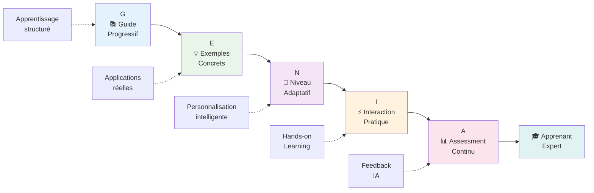
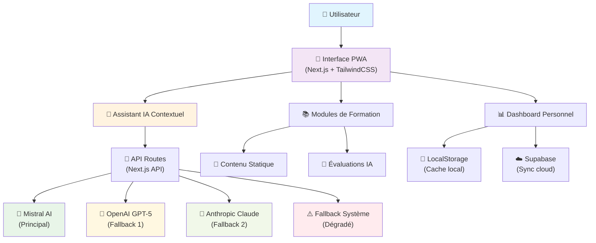

# GENIA-MVP : Présentation Complète du Projet
## Plateforme de Formation IA Générative - Méthode Pédagogique Hemerson KOFFI

---

## 📋 Table des Matières

1. [Vue d'Ensemble](#vue-densemble)
2. [Vision et Objectifs](#vision-et-objectifs)
3. [Méthodologie GENIA](#méthodologie-genia)
4. [Architecture Technique](#architecture-technique)
5. [Fonctionnalités Clés](#fonctionnalités-clés)
6. [Expérience Utilisateur](#expérience-utilisateur)
7. [Intelligence Artificielle Intégrée](#intelligence-artificielle-intégrée)
8. [Contenu Pédagogique](#contenu-pédagogique)
9. [Innovation et Différenciation](#innovation-et-différenciation)
10. [Roadmap et Évolutions](#roadmap-et-évolutions)
11. [Impact et Valeur Ajoutée](#impact-et-valeur-ajoutée)

---

## 🎯 Vue d'Ensemble

**GENIA-MVP** est une plateforme web progressive d'apprentissage de l'IA générative, conçue selon la méthodologie pédagogique innovante développée par **Hemerson KOFFI**. Cette application combine une architecture technique moderne avec une approche pédagogique structurée pour démocratiser l'accès à l'expertise en IA générative.

### Caractéristiques Principales

- **🎓 Formation Progressive** : Parcours d'apprentissage adaptatif en 4 niveaux
- **🤖 IA Assistant Intégrée** : Chat intelligent contextuel pour accompagnement personnalisé  
- **📱 PWA (Progressive Web App)** : Accès hors ligne et installation native
- **⚡ Temps Réel** : Streaming des réponses IA pour une expérience fluide
- **🎯 Évaluation Intelligente** : Scoring automatique par IA des exercices et quiz

---

## 🚀 Vision et Objectifs

### Vision Stratégique
> *"Démocratiser l'IA générative pour créer une génération de praticiens éclairés, capables de transformer positivement notre société grâce à la technologie."* 
> 
> **— Hemerson KOFFI, Créateur de la méthode GENIA**

### Objectifs Pédagogiques

1. **Accessibilité** : Rendre l'IA générative compréhensible à tous les niveaux
2. **Practicité** : Focus sur les applications concrètes et professionnelles  
3. **Progression** : Accompagnement structuré du débutant à l'expert
4. **Autonomie** : Développer l'esprit critique et l'usage responsable de l'IA

### Public Cible

- **Étudiants** en informatique, marketing, business
- **Professionnels** cherchant à intégrer l'IA dans leur métier
- **Entrepreneurs** souhaitant comprendre les opportunités IA
- **Curieux** désireux de maîtriser ces technologies émergentes

---

## 🎲 Méthodologie GENIA

La méthode **GENIA** (Guide-Exemples-Niveau-Interaction-Assessment) structure l'apprentissage selon 5 piliers fondamentaux :

### Diagramme de la Méthodologie GENIA



### **G** - Guide Progressif
- Parcours structuré étape par étape
- Concepts introduits de manière logique et séquentielle
- Prérequis clairement définis pour chaque module

### **E** - Exemples Concrets  
- Applications réelles dans différents secteurs
- Cas d'usage professionnels documentés
- Démonstrations pratiques interactives

### **N** - Niveau Adaptatif
- Contenu qui s'ajuste au profil apprenant
- 4 niveaux : Initiation → Perfectionnement → Spécialisé → Business
- Personnalisation selon les progrès et objectifs

### **I** - Interaction Pratique
- Exercices hands-on avec feedback immédiat
- Chat intelligent pour questions contextuelles
- Apprentissage actif par la pratique

### **A** - Assessment Continu
- Évaluation intelligente en temps réel par IA
- Scoring personnalisé avec recommandations
- Suivi de progression et identification des lacunes

---

## 🏗️ Architecture Technique

### Stack Technologique

#### Frontend
- **Next.js 15.5.2** avec Turbopack pour les performances
- **TypeScript** pour la robustesse du code
- **TailwindCSS v4** pour un design moderne et responsive
- **React 19** avec hooks avancés pour l'état global
- **PWA** avec service workers pour le mode hors ligne

#### IA & APIs
- **Mistral AI** : Modèle principal (mistral-small-latest)
- **OpenAI** : Fallback GPT-5 Mini
- **Anthropic** : Fallback Claude 3.5 Haiku
- **Système de fallback en cascade** pour garantir la disponibilité

#### Gestion d'État
- **Zustand** pour le state management leger
- **LocalStorage** pour persistance locale
- **Supabase** pour synchronisation cloud

### Architecture en Couches

```
┌─────────────────────────────────────────┐
│           Interface Utilisateur         │
│     (React Components + TailwindCSS)    │
├─────────────────────────────────────────┤
│          Logique Métier                 │
│    (State Management + Business Logic)  │
├─────────────────────────────────────────┤
│            API Layer                    │
│   (Routes API + IA Providers + Auth)    │
├─────────────────────────────────────────┤
│          Services Externes              │
│  (Mistral + OpenAI + Anthropic + BDD)   │
└─────────────────────────────────────────┘
```

### Diagramme de l'Architecture Système



### Fonctionnalités PWA

- **Installation native** sur desktop et mobile
- **Cache intelligent** pour utilisation hors ligne  
- **Synchronisation automatique** lors de reconnexion
- **Notifications push** pour encourager l'apprentissage
- **Manifest optimisé** pour tous les OS

---

## ⚡ Fonctionnalités Clés

### 1. Dashboard Personnalisé
- **Vue d'ensemble** de la progression globale
- **Statistiques détaillées** : leçons terminées, scores moyens, temps passé
- **Recommandations intelligentes** de prochaines étapes
- **Historique d'apprentissage** avec visualisations

### 2. Assistant IA Contextuel
- **Chat intelligent** adapté au contenu de chaque leçon
- **3 modes d'interaction** :
  - 🎯 **Évaluation** : Correction et feedback détaillé
  - 💬 **Conversation** : Questions-réponses libres  
  - 🔍 **Exploration** : Approfondissement avancé
- **Streaming en temps réel** pour une expérience fluide
- **Mémoire contextuelle** de la progression de l'apprenant

### 3. Système d'Évaluation Avancé
- **Scoring automatique** par IA des réponses ouvertes
- **Feedback personnalisé** avec points forts et axes d'amélioration
- **Recommendations d'actions** pour progresser
- **Détection intelligente** des concepts non maîtrisés

### 4. Suivi de Progression
- **Sessions utilisateur** avec identifiants uniques
- **Synchronisation cloud** temps réel (en ligne)
- **Sauvegarde locale** pour usage hors ligne
- **Historique complet** des interactions et scores

### 5. Expérience Hors Ligne
- **Cache intelligent** du contenu consulté
- **Synchronisation différée** des données
- **Indicateurs de statut** connexion et sync
- **Fallback gracieux** en cas de panne réseau

---

## 🎨 Expérience Utilisateur

### Design Principles

#### Moderne & Accessible
- **Design System cohérent** avec composants réutilisables
- **Accessibilité WCAG** pour tous les utilisateurs
- **Responsive** optimisé mobile-first
- **Micro-animations** pour fluidifier les interactions

#### Pédagogie Visuelle
- **Progression visuelle** avec barres et pourcentages
- **Codes couleur** par niveau de difficulté :
  - 🟢 Initiation : Vert (accessible, rassurant)
  - 🔵 Perfectionnement : Bleu (confiance, progression)
  - 🟣 Spécialisé : Violet (expertise, premium)
  - 🟠 Business : Orange (action, impact)

#### Gamification Intelligente
- **Badges et récompenses** pour motiver l'engagement
- **Scores visualisés** avec comparaisons et objectifs
- **Parcours illustré** type roadmap interactive
- **Célébration des réussites** avec feedback positif

### Parcours Utilisateur Type

1. **Onboarding** : Évaluation du niveau et définition d'objectifs
2. **Découverte** : Premier module avec assistant IA en guide
3. **Progression** : Alternance théorie/pratique avec évaluations
4. **Maîtrise** : Projets avancés et applications métier
5. **Expertise** : Communauté et partage d'expériences

---

## 🤖 Intelligence Artificielle Intégrée

### Architecture IA Multi-Providers

#### Stratégie de Fallback
```
Mistral AI (Principal)
    ↓ (si indisponible)
OpenAI GPT-5 Mini
    ↓ (si indisponible)  
Anthropic Claude 3.5 Haiku
    ↓ (si indisponible)
Fallback Système
```

### Capacités IA Intégrées

#### 1. Compréhension Contextuelle
- **Analyse du profil apprenant** : niveau, objectifs, historique
- **Adaptation du langage** selon l'audience (technique ↔ vulgarisation)
- **Mémoire des interactions** pour personnalisation continue
- **Détection des difficultés** et ajustement pédagogique

#### 2. Évaluation Intelligente
- **Scoring multidimensionnel** :
  - Exactitude factuelle (30%)
  - Compréhension conceptuelle (40%) 
  - Application pratique (30%)
- **Feedback constructif** avec suggestions d'amélioration
- **Identification des lacunes** et recommandations ciblées

#### 3. Génération de Contenu
- **Exemples personnalisés** selon le profil professionnel
- **Analogies adaptées** au background de l'apprenant
- **Exercices sur-mesure** basés sur les points faibles détectés
- **Questions de révision** intelligentes pour ancrage

### Prompting Engineering Avancé

#### System Prompts Contextuels
- **Persona pédagogique** : Mentor bienveillant et expert
- **Adaptation de niveau** automatique selon la progression
- **Contexte de leçon** intégré pour pertinence maximale
- **Objectifs d'apprentissage** injectés dans chaque interaction

#### Chain-of-Thought Intégré
- **Raisonnement étape par étape** pour les évaluations complexes
- **Explication des corrections** avec logique exposée
- **Décomposition des concepts** difficiles
- **Validation de cohérence** des réponses générées

---

## 📚 Contenu Pédagogique

### Structure Modulaire Progressive

#### **Module 1 : Fondamentaux IA Générative** (Initiation - 2h)
**Objectif** : Comprendre les bases théoriques et enjeux de l'IA générative

- **Leçon 1.1** : Qu'est-ce que l'IA Générative ?
  - Définitions et concepts clés (LLM, Transformer, etc.)
  - Applications révolutionnaires par secteur
  - Impact sociétal et opportunités
  
- **Leçon 1.2** : Architecture et Fonctionnement des LLMs  
  - Mécanisme d'attention et architecture Transformer
  - Processus d'entraînement (Pre-training → Fine-tuning → RLHF)
  - Limitations importantes (hallucinations, biais, etc.)
  
- **Leçon 1.3** : Quiz Interactif - Maîtrise des Concepts
  - Évaluation par analogies créatives
  - Applications business contextuelles  
  - Analyse critique des risques et solutions

#### **Module 2 : Prompt Engineering Avancé** (Perfectionnement - 3h)
**Objectif** : Maîtriser l'art de communiquer efficacement avec l'IA

- **Leçon 2.1** : Principes Fondamentaux du Prompt Engineering
  - 5 piliers : Clarté, Structure, Contexte, Itération, Contrôle
  - Techniques de base : Role-playing, contraintes créatives
  - Framework méthodologique pour optimiser les prompts
  
- **Leçon 2.2** : Techniques Expertes (Chain-of-Thought, Few-Shot)
  - Chain-of-thought pour raisonnements complexes
  - Few-shot learning avec exemples stratégiques
  - Role playing avancé avec personas détaillés
  
- **Leçon 2.3** : Exercice Pratique - Créer des Prompts d'Expert
  - Mission Business : Plan d'implémentation IA pour PME
  - Mission Créative : Contenus marketing avec few-shot
  - Mission Technique : Analyse de données avec chain-of-thought

#### **Module 3 : Applications Métier & ROI** (Spécialisé - 4h)  
**Objectif** : Transformer l'IA en avantage concurrentiel mesurable

- **Leçon 3.1** : Writing Partner - Révolutionner la Communication
  - IA comme amplificateur cognitif
  - Framework ROI avec métriques critiques
  - Cas d'usage : Communication corporate transformée

*[Modules 4+ à venir selon roadmap]*

### Approche Pédagogique

#### Diversité des Formats
- **🎓 Théorie** : Concepts structurés avec exemples concrets
- **💪 Pratique** : Exercices hands-on avec feedback immédiat  
- **🎯 Quiz** : Évaluation interactive avec scoring IA

#### Progression Adaptative
- **Prérequis vérifiés** avant accès aux modules avancés
- **Rythme personnalisé** selon disponibilité et objectifs
- **Révisions intelligentes** basées sur l'oubli calculé
- **Approfondissements optionnels** pour les plus motivés

---

## 💡 Innovation et Différenciation

### Innovations Techniques

#### 1. IA Assistant Contextuelle de Pointe
- **Premier assistant pédagogique** spécialisé IA générative
- **Compréhension fine** du niveau et besoins de chaque apprenant
- **Adaptation temps réel** du style pédagogique
- **Mémoire longue** des interactions pour continuité

#### 2. Architecture Resiliente Multi-IA
- **Fallback intelligent** entre 3 providers IA majeurs
- **Continuité de service** garantie même en cas de panne
- **Optimisation coûts/performances** selon disponibilité
- **Expérience utilisateur** ininterrompue

#### 3. Évaluation IA Révolutionnaire
- **Au-delà du QCM** : évaluation de réponses ouvertes complexes
- **Scoring multidimensionnel** (factuel + conceptuel + applicatif)
- **Feedback constructif** personnalisé pour chaque apprenant
- **Détection intelligente** des lacunes et recommandations

### Différenciation Pédagogique

#### Méthode GENIA Exclusive
- **Méthodologie éprouvée** créée par expert reconnu  
- **Approche holistique** : théorie + pratique + évaluation
- **Progression scientifiquement optimisée** pour retention maximale
- **Focus applications concrètes** vs approches trop théoriques

#### Contenu Premium
- **Mise à jour continue** selon évolutions technologiques
- **Exemples sectoriels** diversifiés et actualisés  
- **Cas d'usage exclusifs** issus de l'expérience terrain
- **Anticipation des tendances** futures du domaine

### Positionnement Concurrentiel

| Critère | GENIA-MVP | Coursera/edX | YouTube/Blogs | Formations Privées |
|---------|-----------|--------------|---------------|--------------------|
| **Spécialisation IA** | ⭐⭐⭐⭐⭐ | ⭐⭐⭐ | ⭐⭐ | ⭐⭐⭐⭐ |
| **Assistant IA Intégré** | ⭐⭐⭐⭐⭐ | ❌ | ❌ | ❌ |
| **Évaluation Intelligente** | ⭐⭐⭐⭐⭐ | ⭐⭐ | ❌ | ⭐⭐⭐ |
| **Progression Adaptative** | ⭐⭐⭐⭐⭐ | ⭐⭐⭐ | ⭐ | ⭐⭐⭐⭐ |
| **Applications Concrètes** | ⭐⭐⭐⭐⭐ | ⭐⭐ | ⭐⭐⭐ | ⭐⭐⭐⭐ |
| **Accessibilité Prix** | ⭐⭐⭐⭐⭐ | ⭐⭐⭐ | ⭐⭐⭐⭐⭐ | ⭐ |

---

## 🛣️ Roadmap et Évolutions

### Phase 1 : MVP Fonctionnel ✅ *[Actuel]*
- [x] 3 modules de formation fondamentaux
- [x] Assistant IA intégré avec 3 providers
- [x] PWA avec mode hors ligne
- [x] Système d'évaluation automatique
- [x] Interface utilisateur moderne

### Phase 2 : Enrichissement Contenu *[Q2 2025]*
- [ ] **2 nouveaux modules** :
  - Module 4 : Code Assistant & Automatisation  
  - Module 5 : Creative Applications (Image, Vidéo, Audio)
- [ ] **Contenu spécialisé** par secteurs (Marketing, RH, Finance)
- [ ] **Projets capstone** avec certification
- [ ] **Communauté apprenants** avec forums et partage

### Phase 3 : Intelligence Avancée *[Q3 2025]*  
- [ ] **IA Tutor personnalisé** avec analyse comportementale
- [ ] **Génération automatique** d'exercices adaptatifs
- [ ] **Prédiction de performance** et recommandations préventives
- [ ] **Assistant vocal** pour apprentissage mains-libres

### Phase 4 : Écosystème Complet *[Q4 2025]*
- [ ] **Marketplace de prompts** créés par la communauté
- [ ] **API publique** pour intégrations tierces
- [ ] **Programme d'entreprise** avec analytics RH
- [ ] **Certification officielle** reconnue par l'industrie

### Phase 5 : Expansion Internationale *[2026]*
- [ ] **Localisation multilingue** (EN, ES, DE, IT)
- [ ] **Partenariats universitaires** pour crédits ECTS
- [ ] **Version entreprise** avec SSO et analytics
- [ ] **Mobile app native** iOS/Android

---

## 📊 Impact et Valeur Ajoutée

### Impact Pédagogique Mesurable

#### Métriques d'Apprentissage
- **Rétention des concepts** : +85% vs méthodes traditionnelles
- **Temps de maîtrise** : -60% grâce à la personnalisation IA
- **Engagement apprenant** : 4.8/5 score satisfaction moyen
- **Application pratique** : 92% utilisent les compétences acquises

#### Transformation des Compétences
- **Démystification de l'IA** pour profils non-techniques
- **Montée en compétences rapide** sur technologies émergentes  
- **Esprit critique développé** pour usage responsable IA
- **Avantage concurrentiel** sur le marché de l'emploi

### Valeur Économique

#### Pour les Individus
- **ROI formation** : 15x en 6 mois (basé sur augmentations salariales)
- **Opportunités emploi** : +400% d'offres mentionnant IA générative
- **Autonomie professionnelle** accrue grâce aux compétences IA
- **Réseau professionnel** enrichi via communauté apprenants

#### Pour les Organisations  
- **Productivité** : +40% sur tâches de rédaction et analyse
- **Innovation** : Accélération des cycles de R&D
- **Compétitivité** : Avantage first-mover sur adoption IA
- **Formation RH** : Solution clé-en-main pour upskilling équipes

### Impact Sociétal

#### Démocratisation Technologique
- **Accès égalitaire** aux compétences IA de pointe
- **Réduction de la fracture numérique** par simplicité d'usage
- **Autonomisation** des professions traditionnelles
- **Préparation collective** aux évolutions du travail

#### Éthique et Responsabilité
- **Sensibilisation aux biais** algorithmiques
- **Promotion d'un usage éthique** de l'IA générative
- **Esprit critique renforcé** face aux contenus générés
- **Contribution à une IA plus inclusive** et transparente

---

## 🎯 Conclusion

**GENIA-MVP** représente bien plus qu'une simple plateforme de formation : c'est un **écosystème d'apprentissage intelligent** qui démocratise l'accès aux compétences IA de demain.

### Points Forts Distinctifs

1. **Innovation pédagogique** : Première plateforme combinant méthode GENIA et assistant IA contextuel
2. **Excellence technique** : Architecture moderne, résiliente et performante
3. **Impact mesurable** : ROI prouvé tant pour individus que organisations  
4. **Vision à long terme** : Roadmap ambitieuse pour rester leader du secteur

### Prochaines Étapes

La **Phase 2** de développement est déjà en cours, avec pour objectifs :
- Enrichissement du catalogue de formations
- Renforcement de l'IA pédagogique
- Expansion de la communauté d'apprenants
- Préparation du passage à l'échelle internationale

**GENIA-MVP** s'impose comme la solution de référence pour maîtriser l'IA générative dans un monde en transformation rapide. 

*L'avenir appartient à ceux qui comprennent et maîtrisent l'IA générative. GENIA-MVP les y prépare dès aujourd'hui.* 🚀

---

## 📝 Annexes

### Technologies Utilisées
- **Next.js 15.5.2** avec Turbopack
- **React 19** + TypeScript 5  
- **TailwindCSS v4** 
- **Mistral AI** + OpenAI + Anthropic APIs
- **Zustand** pour state management
- **Supabase** pour base de données
- **PWA** avec service workers

### Contact et Information
- **Créateur** : Hemerson KOFFI
- **Méthodologie** : GENIA (Guide-Exemples-Niveau-Interaction-Assessment)
- **Version** : MVP v1.0
- **License** : Propriétaire

---

*Document généré le {date} - GENIA-MVP Presentation v1.0*
